## Download

First switch to Desktop mode.

Using a web browser, go to https://akouzoukos.com/apotris and download the latest apotris. You want the **Linux x86_64** version.

Unzip the file to some folder, let's say `/home/deck/Apotris

So the folder will have these contents:
* `/home/deck/Apotris/Apotris` - The executable file
* `/home/deck/Apotris/assets`
* `/home/deck/Apotris/license`
* `/home/deck/Apotris/README.txt`
Well, besides of the executable file the other contents may change with the version

If you are using a keyboard for desktop mode, you can even already run the executable file and play Apotris. But we want to set Apotris to be playable from the steam interface and with the handheld controls...

## Add Apotris to steam

While still on Desktop mode, open Steam.

Go to Library and find the Add a Game button, then add a Non-steam game.

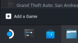

This will show you a list of applications, but Apotris won't be there. So click 'browse' and find the Apotris executable `/home/deck/Apotris/Apotris` , if it's not visible in the folder because the dialog is only showing .exe or appImage files, change the option to show All files.

Now Apotris will appear in the list of applications, select it and continue.

Now Apotris is on Steam:

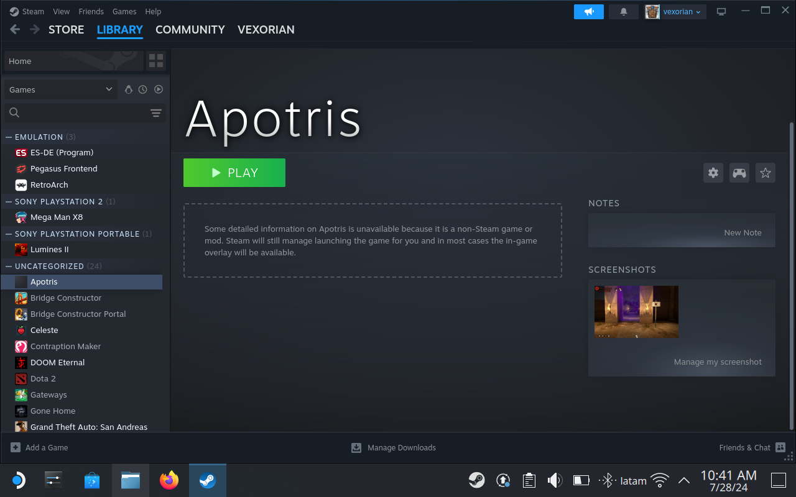

But we are not ready yet. Because it's configured for keyboard controls

## Configure Steam input.

From now on, switch to Gaming mode. We are going to use the handheld controls from now on.

Find Apotris on your steam library, it's probably in the "non-steam games" category. Without an icon or anything.

Click the "controller" icon. This will let you change the button layout.

Change the template to **Keyboard (WASD) and Mouse**

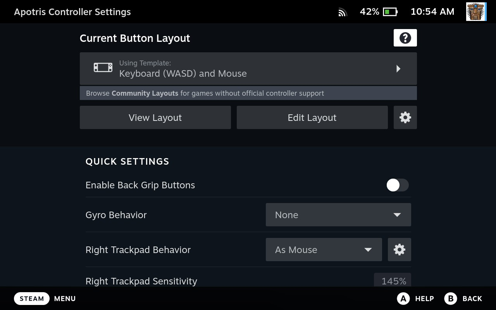

Now go to Edit Layout.

Set the buttons to these values:
* **(A)** : Enter Key
* **(B)** : Backspace Key
* **(X)** : R Key
* **(Y)** : F Key
* **(L1)** : 2 key
* **(R1)** : 1 key
* Squares (the button that's above the left stick) : 3 Key.
* Hamburger (The button that's above the right stick) : Escape
* **Dpad** Use directional pad here, (so they match the up,down,left,right arrow keys)

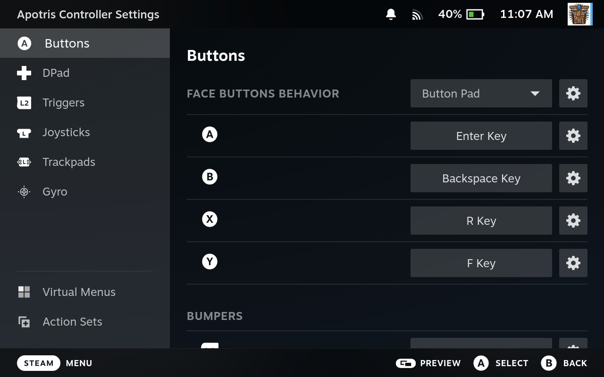
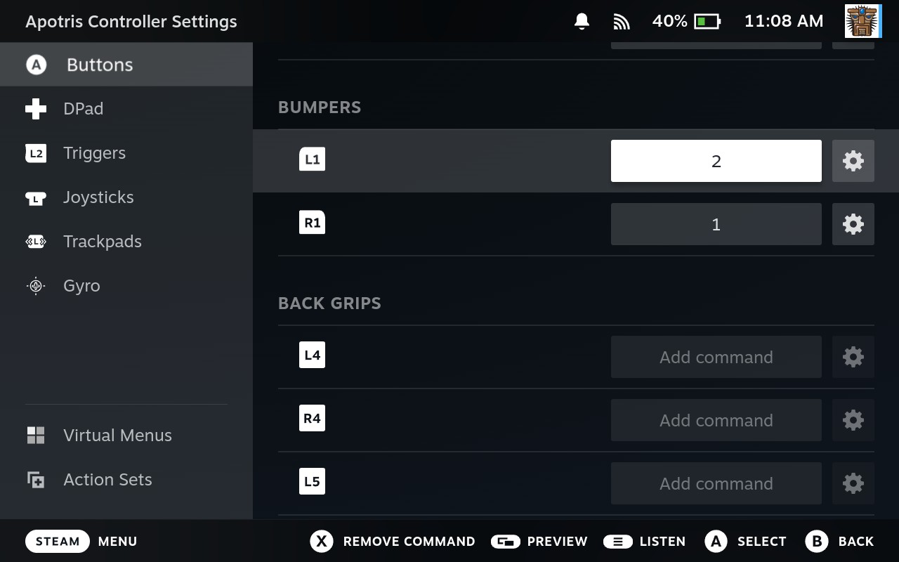
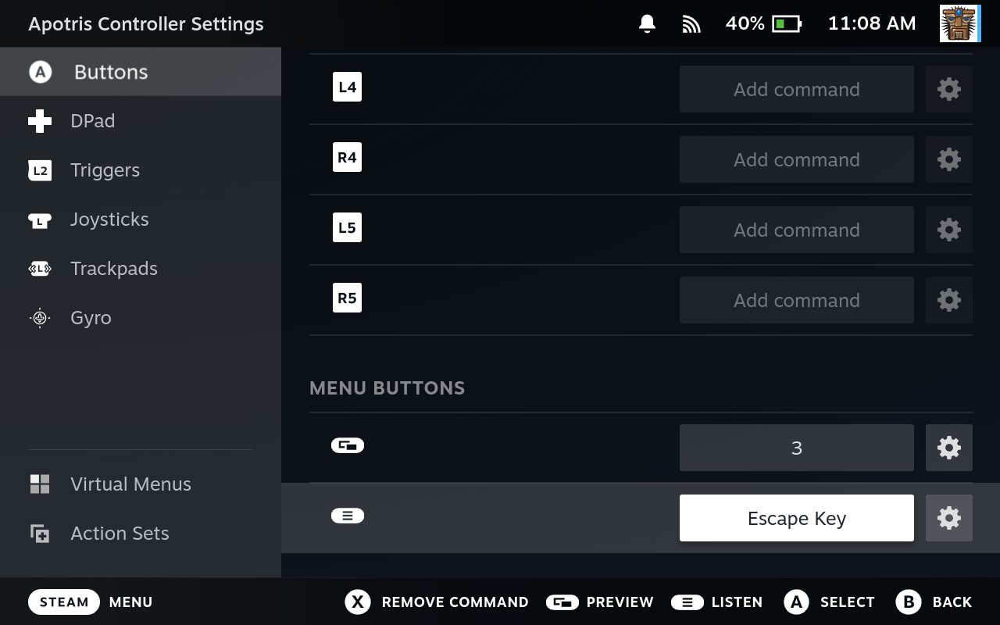
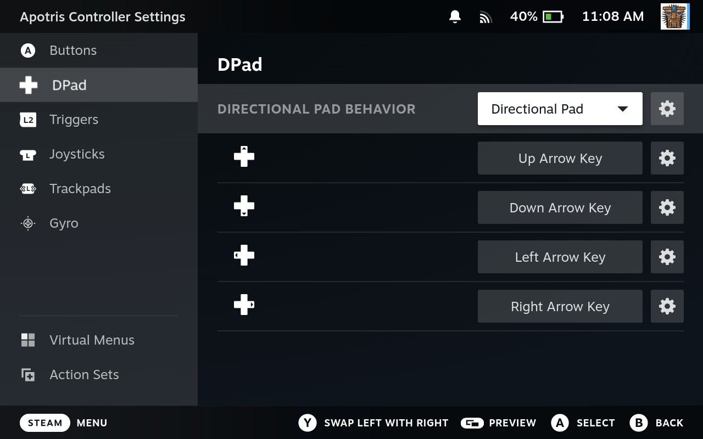

## Configure Controls in Apotris

You are now ready to run apotris.

Initially, it will be difficult to control the menu. For now the only way to move around the menu is by using the Left Analog stick. Use **(A)** to enter menu elements and **(B)** to cancel.

We are going to go to Apotris Control settings so that it uses the dpad both in-game and in menus.

Go to Settings > Controls

Now we are going to assign a button to each command.

* Move Left: (Dpad Left) (It will show as **Left**)
* Move Right: (Dpad Right) (It will show as **Right**)
* Rotate Left: (A button) (It will show as **Return**) , remember your A button is the same as Return.
* Rotate Right: (B button) (It will show as **Backspace**)
* Rotate 180: I dunno, maybe the (Y button)? (It will show as **F**)
* Soft Drop: (Dpad Down) (It will show as **Down**
* Hard Drop: (Dpad Up) (It will show as **Up**)
* Hold: Either R1 or L1 depending what you like, they will show as 1 or 2.
* Activate Zone: Maybe (X) it will show as **R**

For menu keys:
* Up: Dpad Up,
* Down: Dpad Down,
* Left: Dpad Left,
* Right: Dpad Right
* Confirm: (A) (Which will show as Return)
* Cancel: (B) (Which will show as Backspace)
* Pause: (Hamburger) (Which will show as `[Escape]`)
* Special 1: R1 (Will show as 1)
* Special 2: L1 (Will show as 2)
* Special 3: Two squares (Will show as 3)

Now you are ready to play the game. Please note that depending on your taste, you might prefer to swap the keys for Rotate Right and Rotate Left.

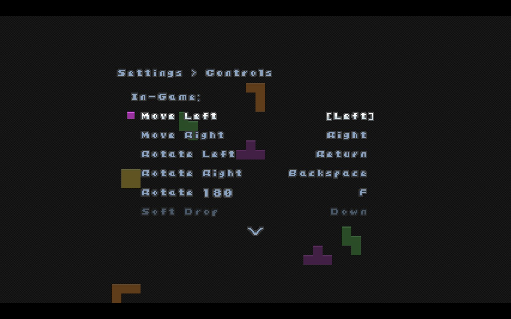
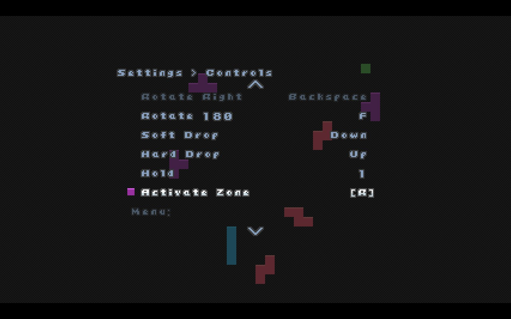
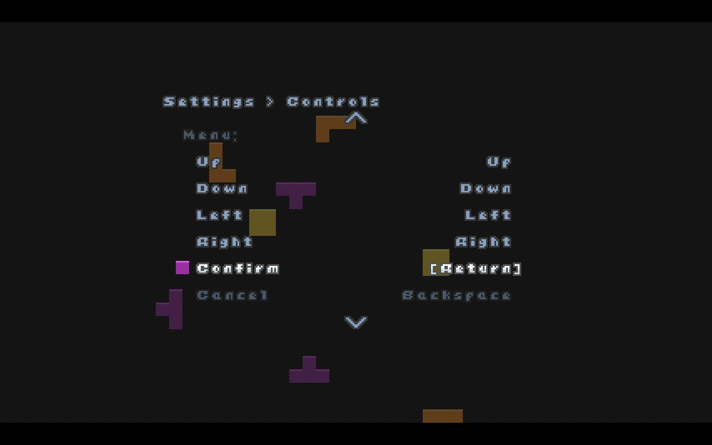
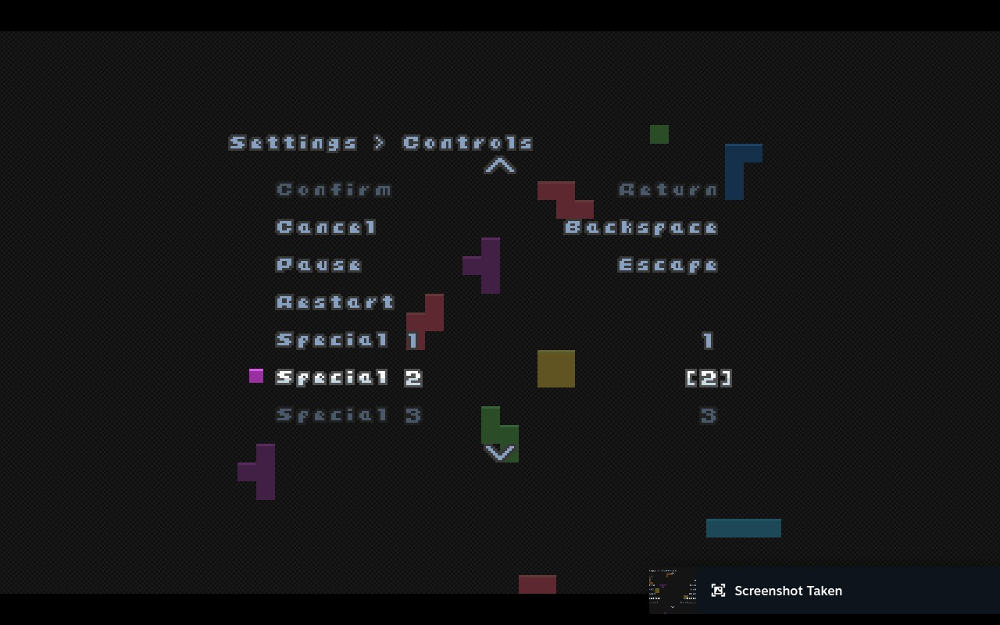

## Fix the scaling

For some reason, at least on 4.0.2 , Apotris on the deck is picking a rather small scale, one of the best things about running native apotris is that we can take advantage of the whole screen.

Go to Settings > Video . Instead of automatic, leave Integer Scale on and change the scale to 4.0.

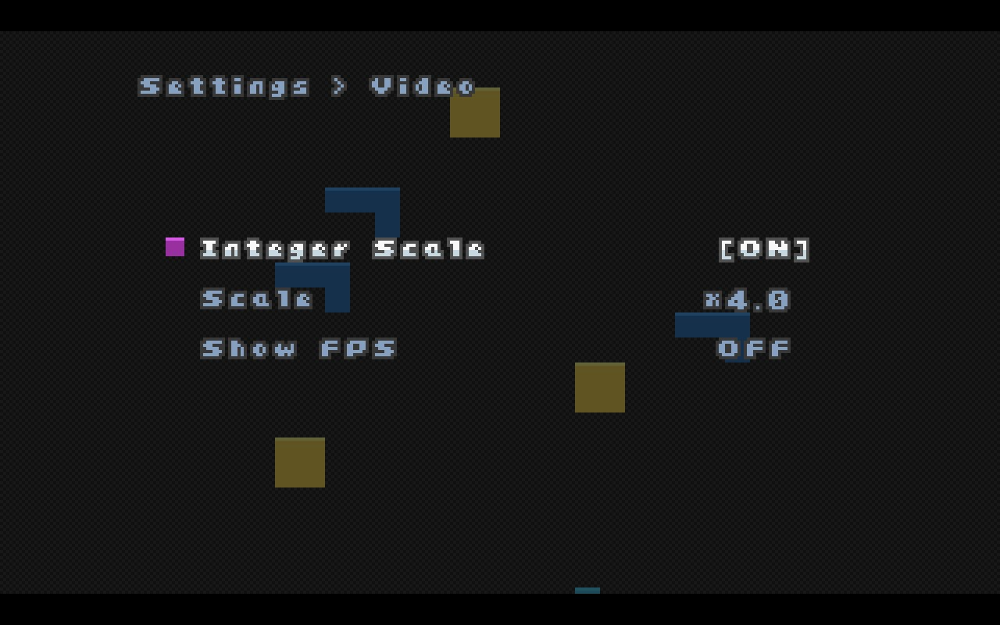

## Add Bling to the Launcher

The game works perfectly, but the launcher is a bit sad and gray. So let's customize the images.

Switch back to Desktop mode.

Our secret weapon here is https://steamgriddb.com

Get the following images (Use the download button)

* https://www.steamgriddb.com/logo/69813 - Logo transparent
* https://www.steamgriddb.com/icon/45988  - Square Icon `256x256`
* https://www.steamgriddb.com/hero/91511  - "Hero" image  `1920x1620`
* https://www.steamgriddb.com/grid/393038 - "Wide" grid image `920x430`
* https://www.steamgriddb.com/grid/384656 - "Cover" grid Image `600x900`

You can get other images if you want, these are just my suggestions.

Open steam and go to the Apotris launcher.

### Icon
To customize the icon, go to the gear button, and click on Properties...

In the Shortcut, next to the name of the game, there will be a gray square, click there. It will let you pick an Icon for apotris. Use the 256x256 image.

Then right click on the background and pick "Set Custom Background" , for the background pick the "Hero" image, you might need to change the file type selector to PNG.

Then right click again and pick "Set Custom Logo" , pick the Logo picture.

The grid images are a bit more tricky. Go to the library and Find the Apotris. It should be your most recent game. In this case, it will be using the wider grid image. Right click and go to pick custom art work and pick the wide grid image.

For the thiner grid image, you have to find Apotris in another place. Maybe scroll down and find the list with All the games. Or play something else and leave so that the "Apotris" in recent starts using the thin cover art. Then you have to 'set custom art' again.

## Check it out

Now we are ready to take a look at the final result. Go back to Gaming mode.

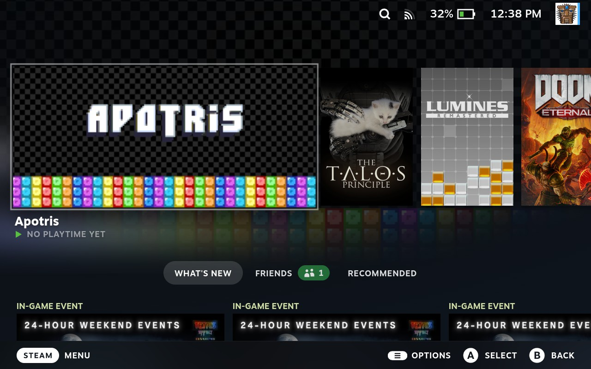
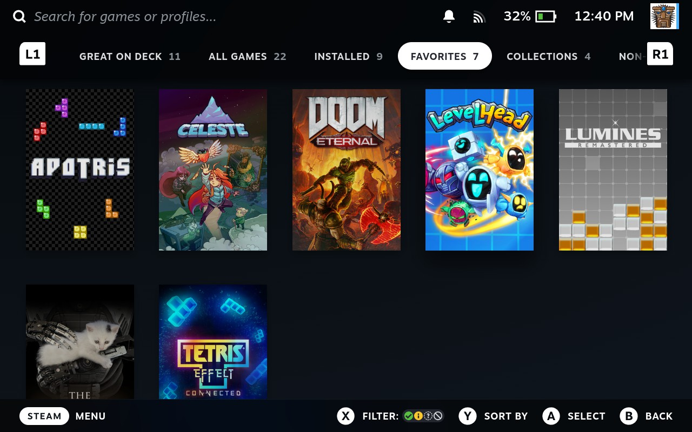
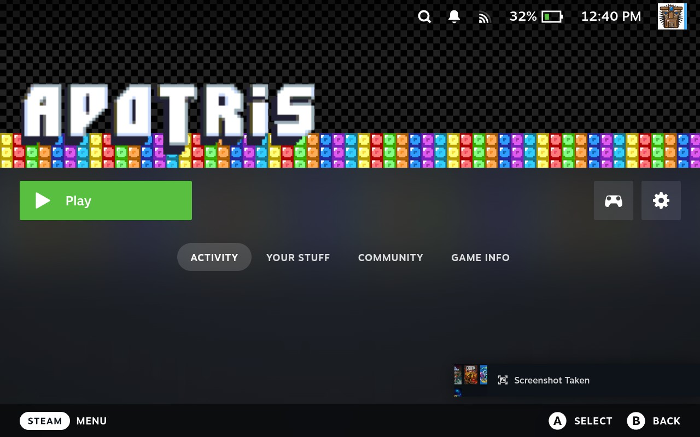

